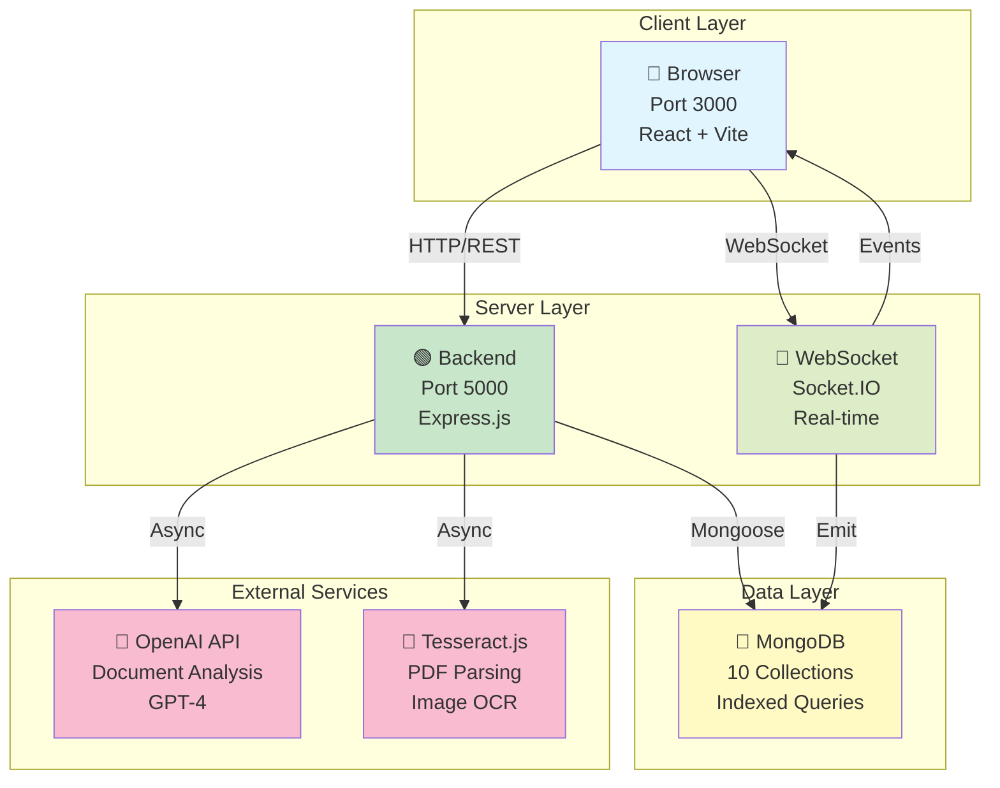
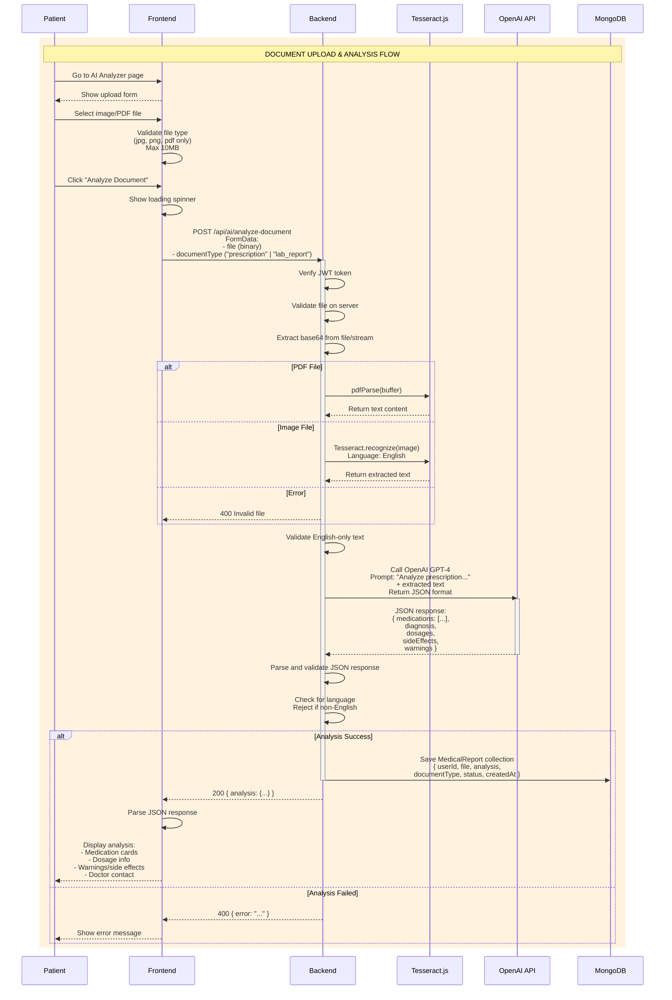
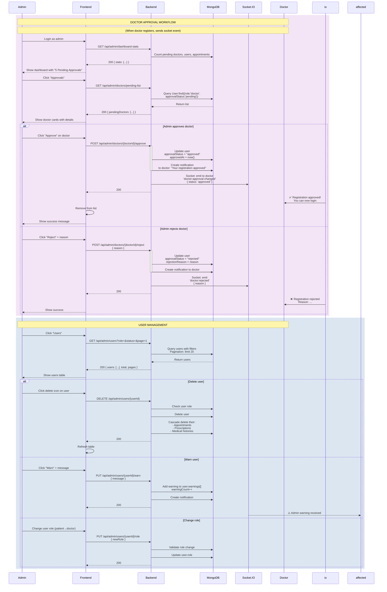
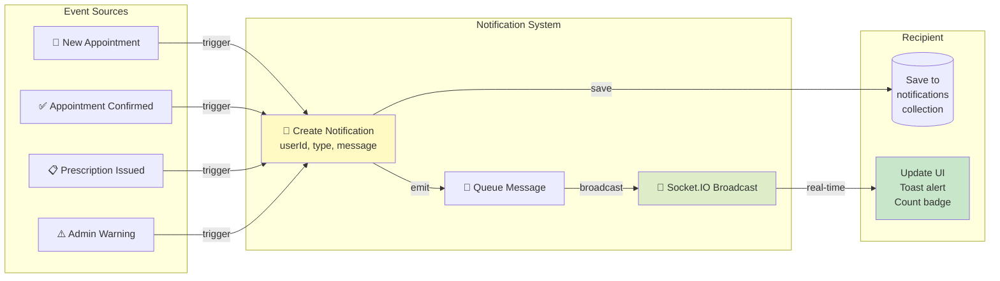
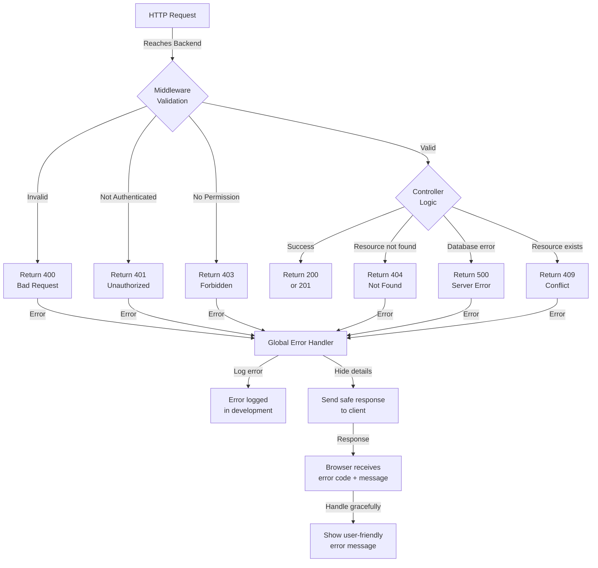

# System Flow & Architecture Diagrams
## Virtual Clinic Management System (VCMS)

---

## 1️⃣ OVERALL SYSTEM ARCHITECTURE



---

## 2️⃣ USER AUTHENTICATION & AUTHORIZATION FLOW

```mermaid
sequenceDiagram
    participant U as User Browser
    participant F as React Frontend
    participant B as Node/Express Backend
    participant DB as MongoDB (users)
    participant CS as Cookie Store

    rect rgb(200, 230, 201)
    Note over U,DB: REGISTRATION FLOW
    U->>F: Fill registration form
    F->>F: Validate client-side
    F->>B: POST /api/auth/register<br/>(firstName, lastName, email, password, role)
    activate B
    B->>B: Validate all fields<br/>- Email domain (Gmail only)<br/>- Phone (10 digits)<br/>- Password strength (8+ chars, 1 upper, 1 num, 1 special)<br/>- Age check if patient (18+)
    B->>DB: Check email/phone exists
    DB-->>B: Not found ✓
    B->>B: Hash password with bcrypt (salt: 10)
    B->>DB: Create new user<br/>approvalStatus = "pending"
    DB-->>B: User saved with _id
    B->>B: Generate JWT token
    deactivate B
    B-->>F: 201 Created<br/>{ message, user, token: null }
    F-->>U: Show: "Awaiting admin approval"
    end

    rect rgb(220, 230, 241)
    Note over U,DB: LOGIN FLOW
    U->>F: Enter email + password
    F->>F: Validate email/password<br/>Check localStorage token
    F->>B: POST /api/auth/login<br/>(email, password)
    activate B
    
    B->>B: Validate inputs
    B->>DB: Find user by email
    DB-->>B: User found
    
    alt User not found
        B-->>F: 401 Unauthorized<br/>Invalid Email or Password
    else Email domains wrong
        B-->>F: 400 Bad Request<br/>Gmail only allowed
    else Account locked (5+ failed attempts)
        B-->>F: 401 Locked<br/>remainingMinutes, unlocksAt
    else Suspended account
        B-->>F: 403 Forbidden<br/>Account suspended
    else Pending/Rejected approval
        B-->>F: 403 Forbidden<br/>Awaiting/Denied approval
    else Password incorrect
        B->>B: Record failed attempt<br/>failedLoginAttempts++
        B->>DB: Save user
        B-->>F: 401 Unauthorized
    else SUCCESS
        B->>B: Clear attempts<br/>lastLoginAt = now()
        B->>B: Generate token pair:<br/>accessToken (15 min)<br/>refreshToken (7 days)
        B->>DB: Save refreshToken to user.refreshTokens[]
        B->>DB: Save user
        B-->>CS: Set httpOnly cookie<br/>(refreshToken)
        deactivate B
        B-->>F: 200 OK<br/>{ token, accessToken,<br/>refreshToken, user }
    end
    
    F->>F: Save accessToken<br/>to localStorage
    F-->>U: Redirect to /dashboard
    end

    rect rgb(255, 243, 224)
    Note over U,DB: PROTECTED ROUTE ACCESS
    U->>F: User clicks protected page
    F->>F: Check localStorage<br/>for accessToken
    
    alt Token missing
        F-->>U: Redirect to /login
    else Token exists
        F->>B: GET /api/appointments<br/>Header: Authorization<br/>'Bearer {accessToken}'
        activate B
        B->>B: Middleware: verify JWT<br/>Extract userId, role
        B->>DB: Check user exists<br/>Check role permissions
        
        alt Token invalid/expired<br/>& refreshToken exists
            B-->>F: 401 Unauthorized<br/>Token expired
            F->>B: POST /api/auth/refresh-token<br/>(refreshToken)
            B->>B: Verify refreshToken
            B->>DB: Check token in user.refreshTokens[]
            B->>B: Generate new accessToken
            B-->>F: 200 { newAccessToken }
            F->>F: Update localStorage
            F->>B: Retry original request with new token
        else Token valid
            B->>DB: Query appointments<br/>Filter by userId
            DB-->>B: Return documents
            deactivate B
            B-->>F: 200 OK { appointments: [...] }
        else No valid refresh token
            F-->>U: Redirect to /login
        end
    end
    end

    rect rgb(243, 229, 245)
    Note over U,DB: LOGOUT FLOW
    U->>F: Click Logout button
    F->>B: POST /api/auth/logout<br/>Header: Authorization
    activate B
    B->>B: Extract userId from token
    B->>DB: Find user
    B->>DB: Remove refreshToken from array
    B->>DB: Set lastLogoutAt = now()
    B->>DB: Save user
    deactivate B
    B-->>CS: Clear refreshToken cookie
    B-->>F: 200 { message: "Logged out" }
    F->>F: Clear localStorage token
    F-->>U: Redirect to /login
    end
```



---

## 3️⃣ DOCTOR-PATIENT APPOINTMENT BOOKING FLOW

```mermaid
sequenceDiagram
    participant P as Patient Client
    participant F as React Frontend
    participant B as Node/Express
    participant DB as MongoDB
    participant IO as Socket.IO
    participant D as Doctor Client

    rect rgb(200, 230, 201)
    Note over P,D: PATIENT BOOKING APPOINTMENT
    
    P->>F: View available doctors
    F->>B: GET /api/public/doctors
    B->>DB: Query User.find({role:'doctor', approvalStatus:'approved'})
    DB-->>B: Return doctors list
    B-->>F: 200 { doctors: [...] }
    F-->>P: Display doctors with availability
    
    P->>F: Select doctor + date/time
    F->>F: Validate selection
    F->>B: GET /api/appointments/available-slots?doctorId=XXX
    B->>DB: Query doctor availability
    B->>DB: Query existing appointments
    B->>B: Calculate free slots
    B-->>F: 200 { availableSlots: [14:00, 14:30, 15:00, ...] }
    F-->>P: Show time picker
    
    P->>F: Confirm appointment
    F->>B: POST /api/appointments<br/>{ doctorId, date, time, symptoms }
    activate B
    
    B->>B: Validate inputs
    B->>B: Check patient approval status
    B->>DB: Check slot still available
    alt Slot taken
        B-->>F: 409 Conflict
    else SUCCESS
        B->>DB: Create appointment<br/>status = "pending"
        B->>DB: Save appointment
        deactivate B
        B->>IO: Socket: emit to doctor<br/>'appointment:new'<br/>{ patientName, symptoms, time }
        B-->>F: 201 Created<br/>{ appointment: { _id, status: 'pending' } }
        io->>D: 🔔 New appointment request
    end
    
    F-->>P: Show "Awaiting doctor confirmation"
    
    end

    rect rgb(220, 230, 241)
    Note over P,D: DOCTOR RESPONSE
    
    D->>F: View pending appointments
    F->>B: GET /api/appointments/today
    B->>DB: Query appointments where<br/>doctorId=XXX, status='pending'<br/>date = today
    DB-->>B: Return list
    B-->>F: 200 { appointments: [...] }
    F-->>D: Show appointment cards
    
    alt Doctor accepts
        D->>F: Click "Accept"
        F->>B: POST /api/appointments/{id}/accept
        activate B
        B->>DB: Update appointment<br/>status = "confirmed"
        B->>DB: Create notification<br/>to patient
        B->>DB: Save
        deactivate B
        B->>IO: Socket: emit to patient<br/>'appointment:confirmed'
        B-->>F: 200 { appointment: { status: 'confirmed' } }
        io->>P: ✅ Appointment confirmed!
    
    else Doctor rejects
        D->>F: Click "Reject" + reason
        F->>B: POST /api/appointments/{id}/reject<br/>{ reason }
        activate B
        B->>DB: Update appointment<br/>status = "rejected"
        B->>DB: Create notification to patient
        deactivate B
        B->>IO: Socket: emit to patient<br/>'appointment:rejected'<br/>{ reason }
        B-->>F: 200
        io->>P: ❌ Appointment rejected
    end
    
    end

    rect rgb(255, 243, 224)
    Note over P,D: APPOINTMENT EXECUTION (Video)
    
    P->>F: At appointment time, click "Join"
    F->>B: POST /api/video/create-room<br/>{ appointmentId }
    activate B
    B->>DB: Create VideoSession<br/>roomId = uuid()<br/>status = "waiting"
    B->>DB: Save
    deactivate B
    B-->>F: 200 { roomId }
    F->>IO: Socket: connect to room<br/>emit "join-room"
    
    D->>F: At appointment time, click "Start Consultation"
    D->>IO: Socket: connect to room
    
    IO-->>P: User joined
    IO-->>D: User joined
    
    P<-->D: WebRTC video/audio<br/>via Socket.IO ICE candidates
    
    P->>F: Complete consultation
    F->>B: PUT /api/appointments/{id}/status<br/>{ status: "completed" }
    B->>DB: Update status, actualEndTime
    B->>DB: Update VideoSession<br/>status = "ended", endTime
    B-->>F: 200
    
    D->>F: Create prescription
    F->>B: POST /api/prescriptions<br/>{ appointmentId, medications: [...],<br/>diagnosis, treatmentPlan }
    B->>DB: Create prescription<br/>status = "draft"
    B-->>F: 200
    
    D->>F: Click "Issue Prescription"
    F->>B: POST /api/prescriptions/{id}/issue
    B->>DB: Update prescription<br/>status = "issued"<br/>issuedAt = now()
    B->>DB: Create notification<br/>to patient
    B->>IO: Socket: emit to patient<br/>'prescription:issued'
    B-->>F: 200
    io->>P: 📋 New prescription available
    
    end
```

---

## 4️⃣ MEDICAL DOCUMENT ANALYSIS (OCR + AI)



---

## 5️⃣ ADMIN APPROVAL & USER MANAGEMENT



---

## 6️⃣ REAL-TIME NOTIFICATIONS



---

## 7️⃣ ROLES & PERMISSIONS MATRIX

```
ROUTE                                  PATIENT  DOCTOR   ADMIN   PUBLIC
POST   /api/auth/register                ✅       ✅       ✅       ✅
POST   /api/auth/login                   ✅       ✅       ✅       ✅
GET    /api/public/doctors                ✅       ✅       ✅       ✅
POST   /api/appointments                  ✅       ❌       ❌       ❌
POST   /api/appointments/:id/accept       ❌       ✅       ❌       ❌
GET    /api/prescriptions                 ✅       ✅       ✅       ❌
POST   /api/prescriptions/:id/issue       ❌       ✅       ❌       ❌
GET    /api/admin/users                   ❌       ❌       ✅       ❌
DELETE /api/admin/users/:id               ❌       ❌       ✅       ❌
GET    /api/medical-history               ✅       ✅       ✅       ❌
POST   /api/consultations                 ✅       ✅       ✅       ❌
GET    /api/notifications                 ✅       ✅       ✅       ❌
```

---

## 8️⃣ ERROR HANDLING FLOW



---

## ✅ FLOW VERIFICATION

- [x] Registration → approval → login flow complete
- [x] JWT token + refresh token system implemented
- [x] Doctor-patient appointment flow end-to-end
- [x] Video consultation with Socket.IO
- [x] Document analysis with OCR + AI
- [x] Real-time notifications via Socket.IO
- [x] Admin approval and user management
- [x] Role-based access control on all routes
- [x] Error handling with proper status codes
- [x] Cascade delete for data integrity

